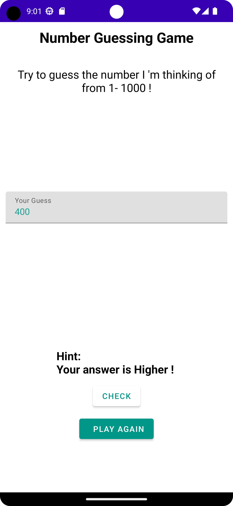
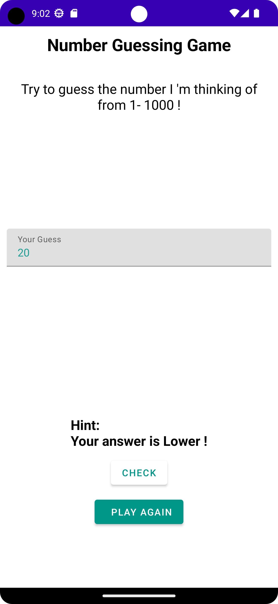
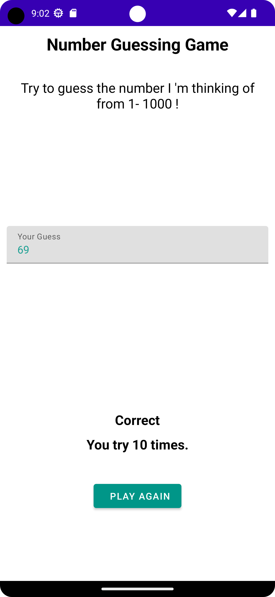

# CN333_Assignment 1

## เกมสุ่มตัวเลข (Number Guessing Game)
- ผู้เล่นสามารถป้อนจำนวนเพื่อทายได้
- ระบบมีวิธีบอกใบ้ผู้เล่นว่าทายถูกหรือจำนวนที่ถูกสูงกว่าหรือจ่ำกว่าจำนวนที่ทายได้
- ระบบจะหยุดเมื่อทายถูก และแสดงจำนวนครั้งที่ผู้เล่นทายก่อนทายถูก
- สามารเล่นเกมใหม่ได้

# สมาชิกในกลุ่ม
#### Variya Kittiwattanachok 6310610958
#### Woraphat Wannaphong 6310611055
#### Pavisa Sirirojvorakul 6310620064

# ขั้นตอนการใช้งาน
1. git clone https://github.com/6310611055/CN333_as1.git
2. Android Studio เลือก file => new => import project => เลือกfileที่cloneไว้
3. กด Run or Shift + F10

# Demo สาธิตวิธีการเล่น
LinkVideo=> [Click_Here](https://youtu.be/H33QJ3YbSHU)

# ตัวอย่าง Display Android App
เมื่อเริ่มRunขึ้นมา

เมื่อทำการกรอกตัวเลขที่จำนวนน้อยกว่าคำตอบที่ถูกต้อง

เมื่อทำการกรอกตัวเลขที่จำนวนมากกว่าคำตอบที่ถูกต้อง

เมื่อทำการกรอกตัวเลขที่ถูกต้อง

